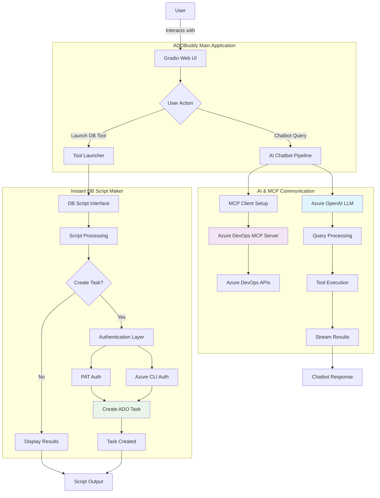

# ADOBuddy Python VS

A comprehensive Azure DevOps (ADO) assistant platform that combines AI-powered chatbot capabilities with specialized database script management tools. This project integrates with Azure DevOps through the Model Context Protocol (MCP) to provide intelligent work item management and automated task creation.

## 🌟 Overview

ADOBuddy Python VS is a dual-purpose application consisting of:

1. **ADOBuddy Chatbot** - An AI-powered conversational interface for Azure DevOps operations
2. **Instant DB Script Maker** - A specialized tool for database script processing and Azure DevOps task creation

## 🚀 Key Features

### ADOBuddy Chatbot (`ADOBuddyPythonVS.py`)
- **Intelligent Azure DevOps Assistant**: Query work items, bugs, and tasks using natural language
- **MCP Integration**: Seamless communication with Azure DevOps through Model Context Protocol
- **Azure OpenAI Integration**: Powered by Azure OpenAI for advanced natural language processing
- **Real-time Streaming**: Live updates and logs during tool execution
- **Work Item Management**: Read, update, and manage Azure DevOps work items
- **Modern Web UI**: Built with Gradio for an intuitive user experience

### Instant DB Script Maker (`InstantDBScriptMaker.py`)
- **Database Script Processing**: Enter, validate, and process SQL scripts
- **Team Management Integration**: Select teams and managers from predefined configurations
- **Automatic Task Creation**: Generate Azure DevOps tasks directly from database scripts
- **Multiple Authentication Methods**: Support for both PAT and Azure CLI authentication
- **Standalone Interface**: Launches in a separate tab for focused script work

## 🏗️ Architecture & Flow



## 📋 Prerequisites

- Python 3.8+
- Node.js (for MCP server)
- Azure DevOps organization access
- Azure OpenAI service

## 🛠️ Installation

1. **Clone the repository**
   ```bash
   git clone <repository-url>
   cd ADOBuddyPythonVS
   ```

2. **Install Python dependencies**
   ```bash
   pip install -r requirements.txt
   ```

3. **Install Azure CLI and Node.js from official company portal**
   Check-NodeAzurenew.ps1 file helps installing Azure CLI and Node.js from official company portal for TR internal users.
   Run the file as powershell.
   

## 🚀 Usage

### Running the Main Application

```bash
python ADOBuddyPythonVS.py
```

The application will launch at `http://127.0.0.3:7880` with:
- Main chatbot interface for Azure DevOps queries
- Tools menu with access to DB Script Maker
- Real-time streaming of AI responses

### Running DB Script Maker Standalone

```bash
python InstantDBScriptMaker.py
```

Launches at `http://127.0.0.3:7881` for dedicated database script processing.

### Example Queries

**Chatbot Examples:**
- "List me 1 task that I am assigned to in Azure DevOps in taxprof project"
- "Show me all my assigned work items"
- "What are the open bugs in taxprof project?"

**DB Script Maker:**
- Enter SQL scripts
- Select appropriate team/manager
- Optionally create Azure DevOps tasks automatically

## 🔐 Authentication

### Azure CLI
1. Install Azure CLI
2. Run `az login`
3. Set default organization: `az devops configure --defaults organization=https://dev.azure.com/your-org`
Note : All steps are covered in powershell file mentioned above so need to run explicitly.

## 📁 Project Structure

```
ADOBuddyPythonVS/
├── ADOBuddyPythonVS.py          # Main chatbot application
├── InstantDBScriptMaker.py      # DB script processing tool
├── setup_auth.py                # Authentication setup helper
├── TeamNameAndManager.json      # Team configuration data
├── requirements.txt             # Python dependencies
├── .env.template               # Environment configuration template
├── .env                        # Environment configuration (create from template)
├── README_AUTH_FIX.md          # Authentication troubleshooting guide
└── .github/
    └── copilot-instructions.md  # Development guidelines
```

## 🔧 Configuration Files

- **`.env`**: Environment variables and API keys
- **`TeamNameAndManager.json`**: Team and manager mappings for task assignment
- **`requirements.txt`**: Python package dependencies

## 🤖 AI & MCP Integration

The application leverages:
- **Azure OpenAI**: For natural language understanding and response generation
- **MCP (Model Context Protocol)**: For structured communication with Azure DevOps
- **LangChain**: For AI agent orchestration and tool management
- **Gradio**: For modern web interface and real-time streaming

## 🚨 Limitations

- **Chatbot functionality is limited to reading task data and updating specific fields**
- **Task creation and deletion are restricted through the chatbot interface**
- **Use the DB Script Maker tool for creating new Azure DevOps tasks**

## 🔍 Troubleshooting

For authentication issues, see `README_AUTH_FIX.md` for detailed troubleshooting steps.

Common issues:
- **TF400813 errors**: Usually authentication/permission issues
- **Connection failures**: Check Azure DevOps organization URL and credentials
- **Token expiration**: Regenerate PAT tokens as needed

## 🤝 Contributing

1. Follow the patterns established in existing code
2. Prioritize Azure DevOps TypeScript client usage for new tools
3. Ensure clear and concise prompt instructions for AI components
4. Test authentication methods thoroughly

## 📝 License

For TR use Only

## 📞 Support

For issues and questions:
1. Run `python setup_auth.py` for authentication diagnostics
2. Check error messages in the application output
3. Verify permissions in Azure DevOps organization
4. Consider using PAT authentication for better reliability
